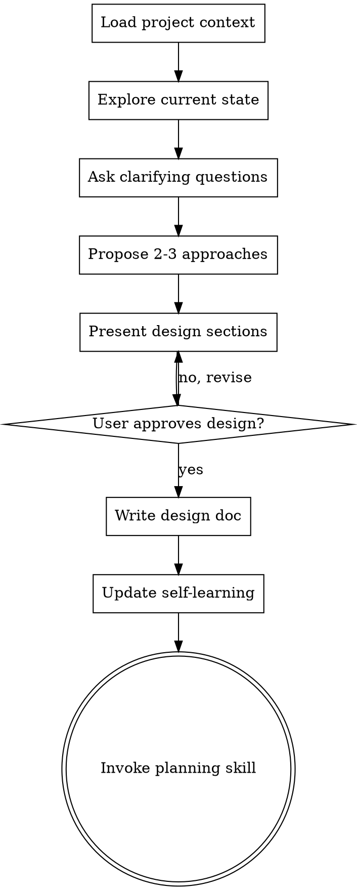

# Brainstorming Ideas Into Designs

## Overview

Help turn ideas into fully formed designs and specs through natural collaborative dialogue. This enhanced version integrates with the self-learning skill to build on known project context.

<HARD-GATE>
Do NOT invoke any implementation skill, write any code, scaffold any project, or take any implementation action until you have presented a design and the user has approved it. This applies to EVERY project regardless of perceived simplicity.
</HARD-GATE>

## Anti-Pattern: "This Is Too Simple To Need A Design"

Every project goes through this process. A todo list, a single-function utility, a config change — all of them. The design can be short (a few sentences for truly simple projects), but you MUST present it and get approval.

## Checklist

You MUST create a task for each of these items and complete them in order:

1. **Load project context** — check memory files for known patterns, stack, conventions
2. **Explore current state** — check files, docs, recent commits
3. **Ask clarifying questions** — one at a time, understand purpose/constraints/success criteria
4. **Propose 2-3 approaches** — with trade-offs and your recommendation
5. **Present design** — in sections scaled to complexity, get approval after each section
6. **Write design doc** — save to `docs/plans/YYYY-MM-DD-<topic>-design.md`
7. **Update self-learning** — persist any new patterns or decisions learned during brainstorming
8. **Transition to planning** — invoke planning skill to create implementation plan

## Process Flow

## The Process

**Understanding the idea:**
- Check memory files first for known project context, stack, and conventions
- Check out the current project state (files, docs, recent commits)
- Ask questions one at a time to refine the idea
- Prefer multiple choice questions when possible
- Only one question per message
- Focus on understanding: purpose, constraints, success criteria

**Exploring approaches:**
- Propose 2-3 different approaches with trade-offs
- Present options conversationally with your recommendation and reasoning
- Lead with your recommended option and explain why
- Consider existing patterns in the codebase

**Presenting the design:**
- Present the design in sections scaled to complexity
- Ask after each section whether it looks right so far
- Cover: architecture, components, data flow, error handling, testing
- Be ready to go back and revise

## After the Design

**Documentation:**
- Write the validated design to `docs/plans/YYYY-MM-DD-<topic>-design.md`
- Commit the design document

**Self-Learning Integration:**
- Update `memory/decisions-log.md` with any architectural decisions made
- Update `memory/learned-patterns.md` if new conventions were discussed
- This ensures future brainstorming sessions build on past decisions

**Transition:**
- Invoke the planning skill to create a detailed implementation plan
- The planning skill is ALWAYS the next step after brainstorming

## Key Principles

- **One question at a time** — Don't overwhelm
- **Multiple choice preferred** — Easier to answer
- **YAGNI ruthlessly** — Remove unnecessary features
- **Explore alternatives** — Always propose 2-3 approaches
- **Incremental validation** — Present and approve in sections
- **Build on context** — Use self-learning memory to avoid re-asking known things
